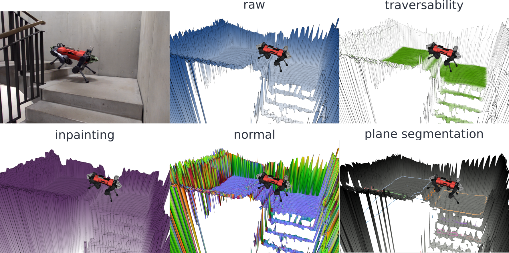

# Elevation Mapping cupy

## Overview

This is a ROS package for elevation mapping on GPU. The elevation mapping code is written in python and uses cupy for GPU computation. The
plane segmentation is done independently and runs on CPU. When the plane segmentation is generated, local convex approximations of the
terrain can be efficiently generated.



## Citing

> Takahiro Miki, Lorenz Wellhausen, Ruben Grandia, Fabian Jenelten, Timon Homberger, Marco Hutter  
> Elevation Mapping for Locomotion and Navigation using GPU  [arXiv](https://arxiv.org/abs/2204.12876)

```
@misc{mikielevation2022,
  doi = {10.48550/ARXIV.2204.12876},
  author = {Miki, Takahiro and Wellhausen, Lorenz and Grandia, Ruben and Jenelten, Fabian and Homberger, Timon and Hutter, Marco},
  keywords = {Robotics (cs.RO), FOS: Computer and information sciences, FOS: Computer and information sciences},
  title = {Elevation Mapping for Locomotion and Navigation using GPU},
  publisher = {International Conference on Intelligent Robots and Systems (IROS)},
  year = {2022},
}
```

## Installation

#### CUDA & cuDNN

The tested versions are CUDA10.2, 11.6

[CUDA](https://docs.nvidia.com/cuda/cuda-installation-guide-linux/index.html#ubuntu-installation)  
[cuDNN](https://docs.nvidia.com/deeplearning/sdk/cudnn-install/index.html#install-linux).

Check how to install [here](doc/cuda-installation.md).

#### Python dependencies

You will need

- [cupy](https://cupy.chainer.org/)
- [numpy](https://www.numpy.org/)
- [scipy](https://www.scipy.org/)
- [shapely==1.7.1](https://github.com/Toblerity/Shapely)

For traversability filter, either of

- [torch](https://pytorch.org/)
- [chainer](https://chainer.org/)

Optionally, OpenCV for inpainting filter.

- [opencv-python](https://opencv.org/)

Install `numpy`, `scipy`, `shapely`, `opencv-python` with the following command.

```bash
pip3 install -r requirements.txt
```

#### Cupy

cupy can be installed with specific CUDA versions. (On jetson, only "from source" i.e. `pip install cupy` could work)
> For CUDA 10.2
> pip install cupy-cuda102
>
> For CUDA 11.0
> pip install cupy-cuda110
>
> For CUDA 11.1
> pip install cupy-cuda111
>
> For CUDA 11.2
> pip install cupy-cuda112
>
> For CUDA 11.3
> pip install cupy-cuda113
>
> For CUDA 11.4
> pip install cupy-cuda114
>
> For CUDA 11.5
> pip install cupy-cuda115
>
> For CUDA 11.6
> pip install cupy-cuda116
>
> (Install CuPy from source)
> % pip install cupy

#### Traversability filter

You can choose either pytorch, or chainer to run the CNN based traversability filter.  
Install by following the official documents.

- [torch](https://pytorch.org/)
- [chainer](https://chainer.org/)

Pytorch uses ~2GB more GPU memory than Chainer, but runs a bit faster.  
Use parameter `use_chainer` to select which backend to use.

#### ROS package dependencies

- [pybind11_catkin](https://github.com/ipab-slmc/pybind11_catkin)
- [grid_map](https://github.com/ANYbotics/grid_map)

```bash
sudo apt install ros-noetic-pybind11-catkin
sudo apt install ros-noetic-grid-map-core ros-noetic-grid-map-msgs
```

### On Jetson

#### CUDA CuDNN

`CUDA` and `cuDNN` can be installed via apt. It comes with nvidia-jetpack. The tested version is jetpack 4.5 with L4T 32.5.0.

#### python dependencies

On jetson, you need the version for its CPU arch:

```bash
wget https://nvidia.box.com/shared/static/p57jwntv436lfrd78inwl7iml6p13fzh.whl -O torch-1.8.0-cp36-cp36m-linux_aarch64.whl
pip3 install Cython
pip3 install numpy==1.19.5 torch-1.8.0-cp36-cp36m-linux_aarch64.whl
```

Also, you need to install cupy with

```bash
pip3 install cupy
```

This builds the packages from source so it would take time.

#### ROS dependencies

- [pybind11_catkin](https://github.com/ipab-slmc/pybind11_catkin)
- [grid_map](https://github.com/ANYbotics/grid_map)

```bash
sudo apt install ros-melodic-pybind11-catkin
sudo apt install ros-melodic-grid-map-core ros-melodic-grid-map-msgs
```

Also, on jetson you need fortran (should already be installed).

```bash
sudo apt install gfortran
```

If the Jetson is set up with Jetpack 4.5 with ROS Melodic the following package is additionally required:

```bash
git clone git@github.com:ros/filters.git -b noetic-devel
```

### Plane segmentation dependencies

#### OpenCV

```bash
sudo apt install libopencv-dev
```

#### Eigen

```bash
sudo apt install libeigen3-dev
```

#### CGAL

CGAL5 is required. It will be automatically downloaded and installed into the catkin workspace by the cgal5_catkin package. Make sure you
have the third-party libaries installed on you machine:

```bash
sudo apt install libgmp-dev
sudo apt install libmpfr-dev
sudo apt install libboost-all-dev
```

## Usage

### Build

```bash
catkin build elevation_mapping_cupy
catkin build convex_plane_decomposition_ros
```

#### Errors

If you get error such as

```
Make Error at /usr/share/cmake-3.16/Modules/FindPackageHandleStandardArgs.cmake:146 (message):
  Could NOT find PythonInterp: Found unsuitable version "2.7.18", but
  required is at least "3" (found /usr/bin/python)
```

Build with option.

```bash
catkin build elevation_mapping_cupy -DPYTHON_EXECUTABLE=$(which python3)
```

### Run

Basic usage.

```bash
roslaunch elevation_mapping_cupy elevation_mapping_cupy.launch
```

For the plane segmentation node

```bash
roslaunch convex_plane_decomposition_ros convex_plane_decomposition.launch
```

#### Errors
If you build with the install flag under ros melodic, you might get issues with the modules not found:

```bash
terminate called after throwing an instance of 'pybind11::error_already_set'
  what():  ModuleNotFoundError: No module named 'elevation_mapping_cupy'
```
This is because python3 modules are installed into a different location.

This can be fixed by including also the python3 modules location in the `PYTHONPATH` by adding following line into the launch file:

```xml
<env name="PYTHONPATH" value="<path_to_your_install>/lib/python3/dist-packages:$(env PYTHONPATH)" />
```

### Run TurtleBot example

First, install turtlebot simulation.

```bash
sudo apt install ros-noetic-turtlebot3-gazebo ros-noetic-turtlebot3-teleop
```

Then, you can run the examples. For the basic version:

```bash
export TURTLEBOT3_MODEL=waffle
roslaunch elevation_mapping_cupy turtlesim_example.launch
```

Or, for the version including plane segmentation:

```bash
catkin build convex_plane_decomposition_ros
export TURTLEBOT3_MODEL=waffle
roslaunch elevation_mapping_cupy turtlesim_segmentation_example.launch
```

To control the robot with a keyboard, a new terminal window needs to be opened.  
Then run

```bash
export TURTLEBOT3_MODEL=waffle
roslaunch turtlebot3_teleop turtlebot3_teleop_key.launch
```

Velocity inputs can be sent to the robot by pressing the keys `a`, `w`, `d`, `x`. To stop the robot completely, press `s`.

### Subscribed Topics

* topics specified in **`pointcloud_topics`** in **`elevation_mapping_cupy/config/parameters.yaml`** ([sensor_msgs/PointCloud2])

  The distance measurements.

* **`/tf`** ([tf/tfMessage])

  The transformation tree.

* The plane segmentation node subscribes to an elevation map topic ([grid_map_msg/GridMap]). This can be configured in
  **`convex_plane_decomposition_ros/config/parameters.yaml`**

### Published Topics

For elevation_mapping_cupy, topics are published as set in the rosparam.  
You can specify which layers to publish in which fps.

Under `publishers`, you can specify the `topic_name`, `layers` `basic_layers` and `fps`.

```yaml
publishers:
  your_topic_name:
    layers: [ 'list_of_layer_names', 'layer1', 'layer2' ]             # Choose from 'elevation', 'variance', 'traversability', 'time' + plugin layers
    basic_layers: [ 'list of basic layers', 'layer1' ]                # basic_layers for valid cell computation (e.g. Rviz): Choose a subset of `layers`.
    fps: 5.0                                                        # Publish rate. Use smaller value than `map_acquire_fps`.
```

Example setting in `config/parameters.yaml`.

* **`elevation_map_raw`** ([grid_map_msg/GridMap])

  The entire elevation map.

* **`elevation_map_recordable`** ([grid_map_msg/GridMap])

  The entire elevation map with slower update rate for visualization and logging.

* **`elevation_map_filter`** ([grid_map_msg/GridMap])

  The filtered maps using plugins.

The plane segmentation node publishes the following:

* **`planar_terrain`**  ([convex_plane_decomposition_msgs/PlanarTerrain])

  A custom message that contains the full segmentation as a map together with the boundary information.

* **`filtered_map`**  ([grid_map_msg/GridMap])

  A grid map message to visualize the segmentation and some intermediate results. This information is also part of **`planar_terrain`**.

* **`boundaries`**  ([visualization_msgs/MarkerArray])

  A set of polygons that trace the boundaries of the segmented region. Holes and boundaries of a single region are published as separate
  markers with the same color.

* **`insets`**  ([visualization_msgs/PolygonArray])

  A set of polygons that are at a slight inward offset from **`boundaries`**. There might be more insets than boundaries since the inward
  shift can cause a single region to break down into multiple when narrow passages exist.

# Plugins

You can create your own plugin to process the elevation map and publish as a layer in GridMap message.

Let's look at the example.

First, create your plugin file in `elevation_mapping_cupy/script/plugins/` and save as `example.py`.

```python
import cupy as cp
from typing import List
from .plugin_manager import PluginBase


class NameOfYourPlugin(PluginBase):
    def __init__(self, add_value:float=1.0, **kwargs):
        super().__init__()
        self.add_value = float(add_value)

    def __call__(self, elevation_map: cp.ndarray, layer_names: List[str],
            plugin_layers: cp.ndarray, plugin_layer_names: List[str])->cp.ndarray:
        # Process maps here
        # You can also use the other plugin's data through plugin_layers.
        new_elevation = elevation_map[0] + self.add_value
        return new_elevation
```

Then, add your plugin setting to `config/plugin_config.yaml`

```yaml
example:                                      # Name of your filter
  type: "example"                             # Specify the name of your plugin (the name of your file name).
  enable: True                                # weather to load this plugin
  fill_nan: True                              # Fill nans to invalid cells of elevation layer.
  is_height_layer: True                       # If this is a height layer (such as elevation) or not (such as traversability)
  layer_name: "example_layer"                 # The layer name.
  extra_params:                               # This params are passed to the plugin class on initialization.
    add_value: 2.0                            # Example param
    
example_large:                                # You can apply same filter with different name.
  type: "example"                             # Specify the name of your plugin (the name of your file name).
  enable: True                                # weather to load this plugin
  fill_nan: True                              # Fill nans to invalid cells of elevation layer.
  is_height_layer: True                       # If this is a height layer (such as elevation) or not (such as traversability)
  layer_name: "example_layer_large"           # The layer name.
  extra_params:                               # This params are passed to the plugin class on initialization.
    add_value: 100.0                          # Example param with larger value.
```

Finally, add your layer name to publishers in `config/parameters.yaml`. You can create a new topic or add to existing topics.

```yaml
  plugin_example: # Topic name
    layers: [ 'elevation', 'example_layer', 'example_layer_large' ]
    basic_layers: [ 'example_layer' ]
    fps: 1.0        # The plugin is called with this fps.
```
