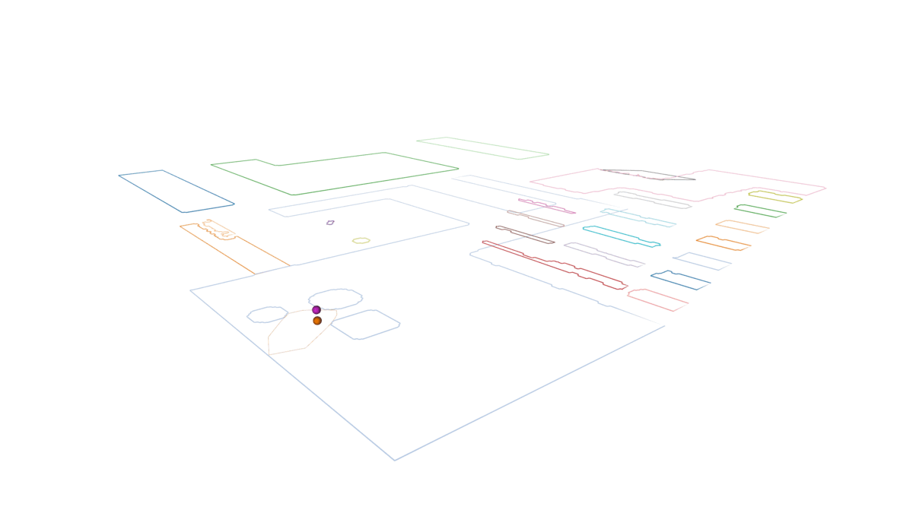
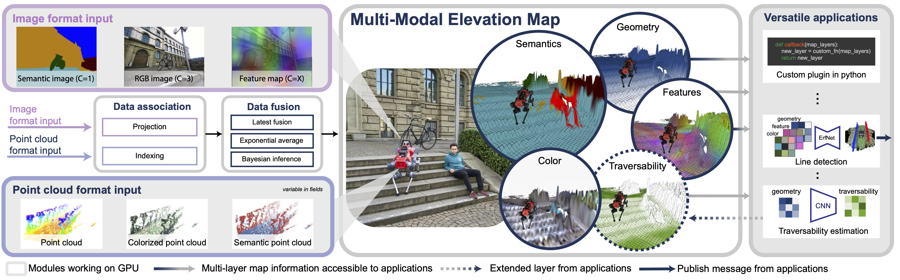

# ROS2 Elevation Mapping Cupy 
 **Status**: Under Development 🚧
## Features 
- **Point cloud-based map update**: *Functional*
- **Image-based map update**: *Ongoing development*
- **C++ Node**: *Functional*
- **Python Node**: *Functional*
- **Docker & VS Code Devcontainer**: *Provided*

<!--  -->

## Installation
A docker file, installation and build scripts, and a VS Code Dev Container have all been provided to ease integration and development.
This has been tested with Ubuntu 22.04, ROS 2 Humble, Zenoh RMW, CUDA 12.1, and PyTorch 2.6.0.
Some dependency issues with numpy, transforms3d, scipy, and ros2_numpy arose during setup so if versions of any of these packages are changed you may run into issues.
The package.xml has been updated to ensure most dependencies are automatically installed via rosdep and some extra rosdep entries are provided to ensure proper versioning.
This is not possible for some packages, e.g. pytorch, due to need for providing an --extra-index-url during installation.
Therefore, this requirement is satsified inside of the docker build.

To test out this package with the turtlebot3 Gazebo (classic) simulation you will need to install:
- VS Code
- Docker
- NVIDIA Container Toolkit
- NVIDIA CUDA Toolkit

### Visual Studio Code
```bash
sudo snap install --classic code 
```

### Docker Installation
```bash
# Add Docker's official GPG key
sudo apt-get update
sudo apt-get install ca-certificates curl gnupg -y
sudo install -m 0755 -d /etc/apt/keyrings
curl -fsSL https://download.docker.com/linux/ubuntu/gpg | sudo gpg --dearmor -o /etc/apt/keyrings/docker.gpg
sudo chmod a+r /etc/apt/keyrings/docker.gpg

# Add Docker repository
echo "deb [arch=$(dpkg --print-architecture) signed-by=/etc/apt/keyrings/docker.gpg] https://download.docker.com/linux/ubuntu $(. /etc/os-release && echo "$VERSION_CODENAME") stable" | sudo tee /etc/apt/sources.list.d/docker.list > /dev/null
sudo apt-get update

# Install Docker
sudo apt-get install docker-ce docker-ce-cli containerd.io docker-buildx-plugin docker-compose-plugin -y

```

### NVIDIA Container Toolkit Installation
```bash
# Configure the repository
curl -fsSL https://nvidia.github.io/libnvidia-container/gpgkey | sudo gpg --dearmor -o /usr/share/keyrings/nvidia-container-toolkit-keyring.gpg
curl -s -L https://nvidia.github.io/libnvidia-container/stable/deb/nvidia-container-toolkit.list | sed 's#deb https://#deb [signed-by=/usr/share/keyrings/nvidia-container-toolkit-keyring.gpg] https://#g' | sudo tee /etc/apt/sources.list.d/nvidia-container-toolkit.list

# Update and install
sudo apt-get update
sudo apt-get install -y nvidia-container-toolkit

# Configure Docker for NVIDIA
sudo nvidia-ctk runtime configure --runtime=docker
sudo systemctl restart docker

# Change Docker root folder
cd
mkdir docker
sudo tee /etc/docker/daemon.json > /dev/null <<EOT
{
    "data-root": "$HOME/docker",
    "runtimes": {
        "nvidia": {
            "args": [],
            "path": "nvidia-container-runtime"
        }
    }
}
EOT
```

### NVIDIA CUDA-Toolkit install
Use the following link for install install instructions: 
https://developer.nvidia.com/cuda-12-1-0-download-archive?target_os=Linux&target_arch=x86_64&Distribution=Ubuntu&target_version=22.04&target_type=deb_local

### Docker Configuration and Workspace Cloning
```bash
sudo usermod -aG docker ${USER}
# Use gituser.sh for Git credential setup
```
### Restart Your Computer
- After completing the setup and configuration steps, it is necessary to restart your computer to ensure that all changes take effect.

---------------------------------------------------------

### Run the Container

#### Clone the Elevation Mapping CUPY Repository
```bash
cd /home/<USERNAME>/
git clone -b ros2_humble https://github.com/jwag/elevation_mapping_cupy.git
```

#### Building the Docker Workspace Container
- Open the folder with VS Code
- Select **"Dev Containers: Reopen in container"** in the bottom left from the blue button which will build the docker image.
- Setup the workspace
  ```bash
  ./docker/setup.sh
  ```
- Build the workspace
  ```bash
  ./docker/build.sh

#### Run The Turtlebot3 Demo
The docker should set the environmental variable `TURTLEBOT3_MODEL=waffle_realsense_depth` to select the correct version of the turtlebot to simulate.

In the first terminal start the zenoh router:
```bash
ros2 run rmw_zenoh_cpp rmw_zenohd
```

In a second terminal launch the turtlebot3 in Gazebo with the following command:
```bash
ros2 launch turtlebot3_gazebo turtlebot3_world.launch.py
``` 

In a third terminal launch the elevation mapping node with the configs for the turtle. Set use_python_node to true to override the default use of the cpp node if you wish:
```bash
ros2 launch elevation_mapping_cupy elevation_mapping_turtle.launch.py use_python_node:=false
```

In a fourth terminal run the turtlebot3 teleop node if you want to drive the turtlebot around using the keyboard:
```bash
ros2 run turtlebot3_teleop teleop_keyboard 
```

---

# Elevation Mapping cupy (*Instructions Not Updated for ROS2*)


[Documentation](https://leggedrobotics.github.io/elevation_mapping_cupy/)

## Overview

The Elevaton Mapping CuPy software package represents an advancement in robotic navigation and locomotion.
Integrating with the Robot Operating System (ROS) and utilizing GPU acceleration, this framework enhances point cloud registration and ray casting,
crucial for efficient and accurate robotic movement, particularly in legged robots.




## Key Features

- **Height Drift Compensation**: Tackles state estimation drifts that can create mapping artifacts, ensuring more accurate terrain representation.

- **Visibility Cleanup and Artifact Removal**: Raycasting methods and an exclusion zone feature are designed to remove virtual artifacts and correctly interpret overhanging obstacles, preventing misidentification as walls.

- **Learning-based Traversability Filter**: Assesses terrain traversability using local geometry, improving path planning and navigation.

- **Versatile Locomotion Tools**: Incorporates smoothing filters and plane segmentation, optimizing movement across various terrains.

- **Multi-Modal Elevation Map (MEM) Framework**: Allows seamless integration of diverse data like geometry, semantics, and RGB information, enhancing multi-modal robotic perception.

- **GPU-Enhanced Efficiency**: Facilitates rapid processing of large data structures, crucial for real-time applications.

## Overview



Overview of our multi-modal elevation map structure. The framework takes multi-modal images (purple) and multi-modal (blue) point clouds as
input. This data is input into the elevation map by first associating the data to the cells and then fused with different fusion algorithms into the various
layers of the map. Finally the map can be post-processed with various custom plugins to generate new layers (e.g. traversability) or process layer for
external components (e.g. line detection).

## Citing

If you use the Elevation Mapping CuPy, please cite the following paper:
Elevation Mapping for Locomotion and Navigation using GPU

[Elevation Mapping for Locomotion and Navigation using GPU](https://arxiv.org/abs/2204.12876)

Takahiro Miki, Lorenz Wellhausen, Ruben Grandia, Fabian Jenelten, Timon Homberger, Marco Hutter  

```bibtex
@inproceedings{miki2022elevation,
  title={Elevation mapping for locomotion and navigation using gpu},
  author={Miki, Takahiro and Wellhausen, Lorenz and Grandia, Ruben and Jenelten, Fabian and Homberger, Timon and Hutter, Marco},
  booktitle={2022 IEEE/RSJ International Conference on Intelligent Robots and Systems (IROS)},
  pages={2273--2280},
  year={2022},
  organization={IEEE}
}
```

If you use the Multi-modal Elevation Mapping for color or semantic layers, please cite the following paper:

[MEM: Multi-Modal Elevation Mapping for Robotics and Learning](https://arxiv.org/abs/2309.16818v1)

Gian Erni, Jonas Frey, Takahiro Miki, Matias Mattamala, Marco Hutter

```bibtex
@inproceedings{erni2023mem,
  title={MEM: Multi-Modal Elevation Mapping for Robotics and Learning},
  author={Erni, Gian and Frey, Jonas and Miki, Takahiro and Mattamala, Matias and Hutter, Marco},
  booktitle={2023 IEEE/RSJ International Conference on Intelligent Robots and Systems (IROS)},
  pages={11011--11018},
  year={2023},
  organization={IEEE}
}
```

## Quick instructions to run

### Installation

First, clone to your catkin_ws

```zsh
mkdir -p catkin_ws/src
cd catkin_ws/src
git clone https://github.com/leggedrobotics/elevation_mapping_cupy.git
```

Then install dependencies.
You can also use docker which already install all dependencies.
When you run the script it should pull the image.

```zsh
cd docker
./run.sh
```

You can also build locally by running `build.sh`, but in this case change `IMAGE_NAME` in `run.sh` to `elevation_mapping_cupy:latest`.

For more information, check [Document](https://leggedrobotics.github.io/elevation_mapping_cupy/getting_started/installation.html)

### Build package

Inside docker container.

```zsh
cd $HOME/catkin_ws
catkin build elevation_mapping_cupy
catkin build convex_plane_decomposition_ros  # If you want to use plane segmentation
catkin build semantic_sensor  # If you want to use semantic sensors
```

### Run turtlebot example


```bash
export TURTLEBOT3_MODEL=waffle
roslaunch elevation_mapping_cupy turtlesim_simple_example.launch
```

For fusing semantics into the map such as rgb from a multi modal pointcloud:

```bash
export TURTLEBOT3_MODEL=waffle
roslaunch elevation_mapping_cupy turtlesim_semantic_pointcloud_example.launch
```

For fusing semantics into the map such as rgb semantics or features from an image:

```bash
export TURTLEBOT3_MODEL=waffle
roslaunch elevation_mapping_cupy turtlesim_semantic_image_example.launch
```

For plane segmentation:

```bash
catkin build convex_plane_decomposition_ros
export TURTLEBOT3_MODEL=waffle
roslaunch elevation_mapping_cupy turtlesim_plane_decomposition_example.launch
```

To control the robot with a keyboard, a new terminal window needs to be opened.
Then run

```bash
export TURTLEBOT3_MODEL=waffle
roslaunch turtlebot3_teleop turtlebot3_teleop_key.launch
```

Velocity inputs can be sent to the robot by pressing the keys `a`, `w`, `d`, `x`. To stop the robot completely, press `s`.
