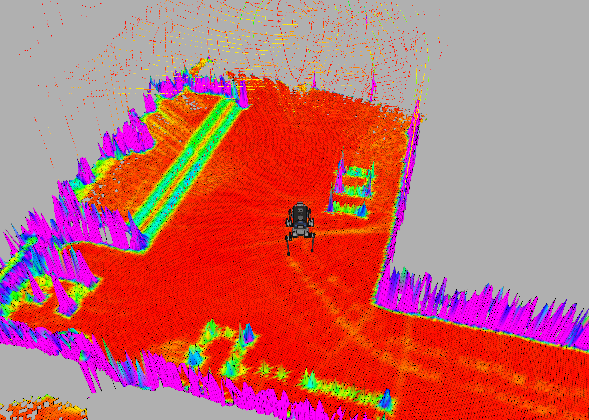

# Elevation Mapping cupy
[](https://ci.leggedrobotics.com/job/<repo_host>_leggedrobotics/job/elevation_mapping_cupy/job/master/)

## Overview
This is a ros package of elevation mapping on GPU.  
Code are written in python and uses cupy for GPU calculation.  


## Installation

### CUDA & cuDNN
The tested versions are CUDA10.0, cuDNN7.

#### CUDA
You can download CUDA10.0 from [here](https://developer.nvidia.com/cuda-10.0-download-archive?target_os=Linux&target_arch=x86_64&target_distro=Ubuntu&target_version=1804&target_type=deblocal).  
You can follow the instruction.
```bash
sudo dpkg -i cuda-repo-ubuntu1804-10-0-local-10.0.130-410.48_1.0-1_amd64.deb
sudo apt-key add /var/cuda-repo-<version>/7fa2af80.pub
sudo apt-get update
sudo apt-get install cuda
```

#### cuDNN
You can download specific version from [here](https://developer.download.nvidia.com/compute/machine-learning/repos/ubuntu1804/x86_64/).  
For example, the tested version is with `libcudnn7-dev_7.5.1.10-1+cuda10.0_amd64.deb` and `libcudnn7_7.5.1.10-1+cuda10.0_amd64.deb`.

Then install them using the command below.
```bash
sudo dpkg -i libcudnn7_7.5.1.10-1+cuda10.0_amd64.deb 
sudo dpkg -i libcudnn7-dev_7.5.1.10-1+cuda10.0_amd64.deb
```

#### Other information
[CUDA](https://docs.nvidia.com/cuda/cuda-installation-guide-linux/index.html#ubuntu-installation)  
[cuDNN](https://docs.nvidia.com/deeplearning/sdk/cudnn-install/index.html#install-linux).

### python dependencies
- [numpy](https://www.numpy.org/)
- [scipy](https://www.scipy.org/)
- [cupy == 6.7.0](https://cupy.chainer.org/)
- [chainer == 6.7.0](https://chainer.org/)
- [shapely == 1.6.4](https://github.com/Toblerity/Shapely)

```bash
pip install numpy scipy cupy chainer shapely
```
On jetson, pip builds the packages from source so it would take time.

Also, on jetson you need to install fortran beforehand.
```bash
sudo apt-get install gfortran
```

cupy can be installed with specific CUDA versions. (On jetson, only "from source" could work)
> (For CUDA 9.0)
> % pip install cupy-cuda90
> 
> (For CUDA 9.1)
> % pip install cupy-cuda91
> 
> (For CUDA 9.2)
> % pip install cupy-cuda92
> 
> (For CUDA 10.0)
> % pip install cupy-cuda100
> 
> (Install CuPy from source)
> % pip install cupy

### ROS package dependencies
- [pybind11_catkin](https://github.com/ipab-slmc/pybind11_catkin)
- [grid_map_msgs](https://github.com/ANYbotics/grid_map)

#### On Jetson
```bash
pip3 install catkin_pkg
```

## Usage
### Build
```bash
catkin build elevation_mapping_cupy
```
### Run
```bash
roslaunch elevation_mapping_cupy elevation_mapping_cupy.launch
```
### Subscribed Topics

* topics specified in **`pointcloud_topics`** in **`parameters.yaml`** ([sensor_msgs/PointCloud2])

    The distance measurements.

* **`/pose`** ([geometry_msgs/PoseWithCovarianceStamped])

    The robot pose and covariance.

* **`/tf`** ([tf/tfMessage])

    The transformation tree.


### Published Topics

* **`elevation_map_raw`** ([grid_map_msg/GridMap])

    The entire elevation map.
    
    
* **`elevation_map_recordable`** ([grid_map_msg/GridMap])

    The entire elevation map with slower update rate for visualization and logging.