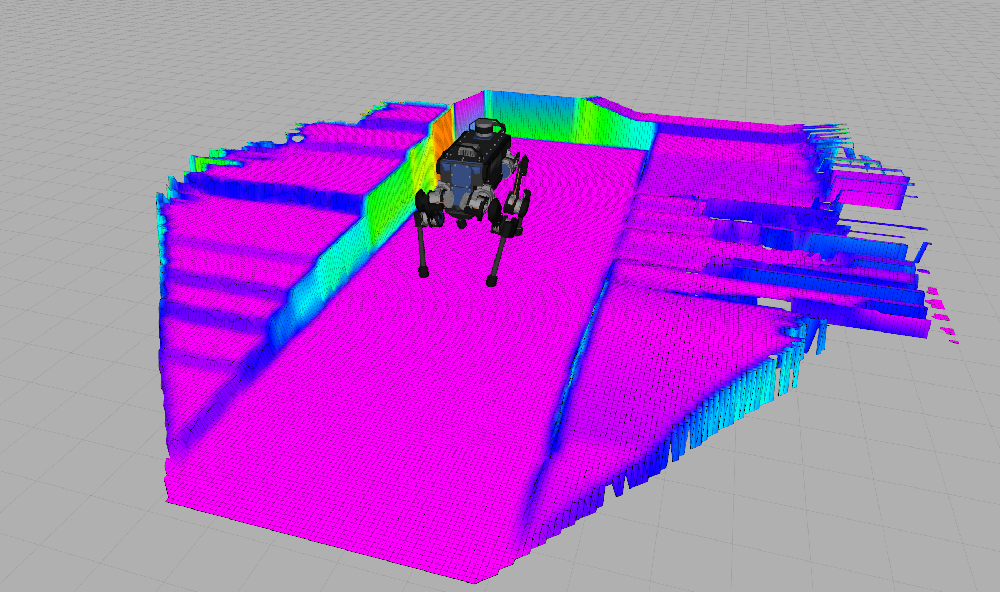
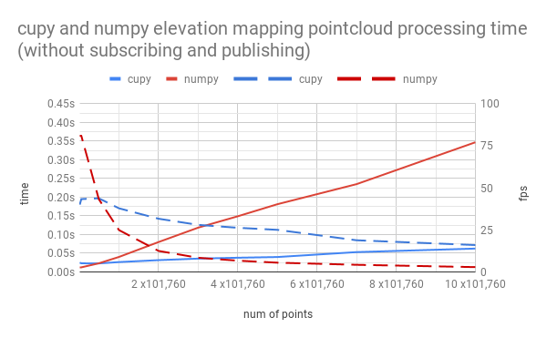

# Elevation Mapping cupy
[](https://ci.leggedrobotics.com/job/<repo_host>_leggedrobotics/job/elevation_mapping_cupy/job/master/)

## Overview
This is a ros package of elevation mapping on GPU.  
Code are written in python and numpy, cupy backend can be selected.



## Installation
### CUDA & cuDNN
First, install CUDA and cuDNN.
Instructions are here [CUDA](https://docs.nvidia.com/cuda/cuda-installation-guide-linux/index.html#ubuntu-installation),
[cuDNN](https://docs.nvidia.com/deeplearning/sdk/cudnn-install/index.html#install-linux).

The tested versions are CUDA10.0, cuDNN7.

### python dependencies
- [numpy](https://www.numpy.org/)
- [scipy](https://www.scipy.org/)
- [cupy](https://cupy.chainer.org/)
- [chainer](https://chainer.org/)

```bash
pip install numpy scipy cupy chainer
```
On jetson, pip builds the packages from source so it would take time.

Also, on jetson you need to install fortran beforehand.
```bash
sudo apt-get install gfortran
```

cupy can be installed with specific CUDA versions. (On jetson, only from source could work)
> (For CUDA 9.0)
> % pip install cupy-cuda90
> 
> (For CUDA 9.1)
> % pip install cupy-cuda91
> 
> (For CUDA 9.2)
> % pip install cupy-cuda92
> 
> (For CUDA 10.0)
> % pip install cupy-cuda100
> 
> (Install CuPy from source)
> % pip install cupy

### pybind11
```bash
pip install pytest
pip3 install pytest
git clone https://github.com/pybind/pybind11.git
cd pybind11
mkdir build
cd build
sudo mkdir /opt/pybind11
cmake .. -DCMAKE_BUILD_TYPE=Release -DCMAKE_INSTALL_PREFIX=/opt/pybind11
make -j8
sudo make install
```

### ROS package dependencies
- [ros_numpy](https://github.com/eric-wieser/ros_numpy)
- [grid_map_msgs](https://github.com/ANYbotics/grid_map)

#### On Jetson
```bash
pip3 install catkin_pkg
```

## Usage
### Build
```bash
catkin build elevation_mapping_cupy
```
### Run
```bash
roslaunch elevation_mapping_cupy elevation_mapping_cupy.launch
```
### Subscribed Topics

* **`/points`** ([sensor_msgs/PointCloud2])

    The distance measurements.

* **`/pose`** ([geometry_msgs/PoseWithCovarianceStamped])

    The robot pose and covariance.

* **`/tf`** ([tf/tfMessage])

    The transformation tree.


### Published Topics

* **`elevation_map`** ([grid_map_msg/GridMap])

    The entire elevation map.

### Processing Time
The processing time of

- pointcloud transform
- elevation map update
- traversability calculation

is measured in P52 laptop which has `Intel� Core� i7-8850H CPU` and `Quadro P3200 `.  
101760 = 424 x 240 is the realsense's number of points.


