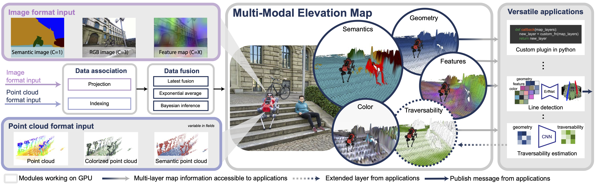

# Elevation Mapping CuPy

**Real-time, GPU-accelerated elevation mapping for ROS 2.**

[](https://docs.ros.org/en/jazzy/)
[](https://github.com/leggedrobotics/elevation_mapping_cupy/releases/latest)
[](https://leggedrobotics.github.io/elevation_mapping_cupy/)
[](LICENSE)

[Documentation](https://leggedrobotics.github.io/elevation_mapping_cupy/) ·
[Latest release](https://github.com/leggedrobotics/elevation_mapping_cupy/releases/latest) ·
[IROS 2022 paper](https://arxiv.org/abs/2204.12876)



Elevation Mapping CuPy turns point clouds and image features into layered
terrain maps for navigation and locomotion. The actively maintained `ros2`
branch targets ROS 2 Jazzy and NVIDIA GPUs with CUDA 12.

## Highlights

- Deterministic CuPy point fusion with visibility cleanup and exact grid-ray traversal.
- Geometry, RGB, semantic, and learned-feature map layers.
- Traversability estimation, inpainting, despiking, smoothing, and custom plugins.
- ROS 2 launch files, GridMap publication, map services, and semantic sensor nodes.
- Reproducible GPU benchmarks and integration tests.

Release `v2.2.0` improves core callback p95 by 55–64% and filtered GridMap
preparation p95 by 26–66% on the maintained RTX 4090 benchmark. See the
[GPU optimization report](docs/development/elevation_mapping_gpu_optimization.md)
for the full methodology.

## Supported branches

| Branch | Status | Purpose |
|---|---|---|
| [`ros2`](https://github.com/leggedrobotics/elevation_mapping_cupy/tree/ros2) | Active | ROS 2 Jazzy and Python/CuPy |
| `main` | Legacy | ROS 1 |
| `ros2_cpp` | Experimental | Community C++ port |

Latest ROS 2 release: [`v2.2.0`](https://github.com/leggedrobotics/elevation_mapping_cupy/releases/tag/v2.2.0).

## Quick start

Requirements: Ubuntu 24.04, ROS 2 Jazzy, Python 3, and an NVIDIA GPU with
CUDA 12 support.

```bash
mkdir -p ~/ros2_ws/src
cd ~/ros2_ws/src
git clone -b ros2 https://github.com/leggedrobotics/elevation_mapping_cupy.git

cd ~/ros2_ws
rosdep install --from-paths src --ignore-src -r -y
colcon build --packages-up-to semantic_sensor elevation_mapping_cupy --symlink-install
source install/setup.bash
```

Run the self-contained synthetic demo:

```bash
ros2 launch elevation_mapping_cupy synthetic_depth_demo.launch.py
```

Run with a robot configuration from `elevation_mapping_cupy/config/setups/`:

```bash
ros2 launch elevation_mapping_cupy elevation_mapping.launch.py \
  robot_config:=menzi/base.yaml
```

For a pinned CUDA/ROS environment, use the included Docker workflow:

```bash
cd ~/ros2_ws/src/elevation_mapping_cupy/docker
./run.sh
```

## Configuration

| Area | Location |
|---|---|
| Map geometry, fusion, and variance | `elevation_mapping_cupy/config/core/core_param.yaml` |
| Post-processing plugins | `elevation_mapping_cupy/config/core/plugin_config.yaml` |
| Robot-specific topics and layers | `elevation_mapping_cupy/config/setups/<robot>/` |

A minimal point-cloud input and map publisher look like this:

```yaml
subscribers:
  lidar:
    topic_name: /points
    data_type: pointcloud

publishers:
  elevation_map:
    layers: [elevation, traversability, variance]
    basic_layers: [elevation]
    fps: 5.0
```

### Raw observation age

Publish optional `observation_age` alongside raw `elevation` when a consumer
needs evidence of new sensor observations. It is seconds since each cell's last
accepted raw cloud endpoint, measured at the GridMap header's source timestamp.
It advances by actual cloud timestamp differences, including callback stalls.
The existing timer-driven `time` layer remains a separate visibility input.

Unknown cells have NaN age. Interpolation, semantic images, map loads, patches,
initialization and newly exposed shift padding cannot create observation
evidence. A nonpositive or nonincreasing source stamp clears that evidence;
only a later strictly increasing cloud can establish it again. Loading a saved
map ignores its saved observation ages. The layer is read-only to map services.
Internal float64 ages round upward when exported to GridMap float32 values.

The V5G restore implementation uses sibling branch
`work/v5g-observation-20261003` in
`~/moleworks/.worktrees/v5g_goal_restore_20261003/elevation_mapping_cupy`, included
in `~/moleworks/ros2_ws_v5g_goal_restore_20261003/src/`. Its Moleworks consumer
requires this layer and does not use legacy `time` as observation evidence.

## Services

| Service | Type | Purpose |
|---|---|---|
| `/elevation_mapping_cupy/clear_map` | `std_srvs/srv/Trigger` | Clear all map layers |
| `/elevation_mapping_cupy/save_map` | `grid_map_msgs/srv/ProcessFile` | Save the current map |
| `/elevation_mapping_cupy/load_map` | `grid_map_msgs/srv/ProcessFile` | Restore a saved map |
| `/elevation_mapping_cupy/masked_replace` | `grid_map_msgs/srv/SetGridMap` | Replace a masked region |

## Testing

```bash
cd ~/ros2_ws
colcon test --packages-select elevation_mapping_cupy --event-handlers console_direct+
PYTEST_DISABLE_PLUGIN_AUTOLOAD=1 python3 -m pytest \
  src/elevation_mapping_cupy/sensor_processing/semantic_sensor/test -q
```

The maintained performance harnesses are in [`benchmarks/`](benchmarks/).
Curated results are versioned; raw profiler traces and local logs are ignored.

## Citation

If you use this project, please cite:

```bibtex
@inproceedings{miki2022elevation,
  title={Elevation mapping for locomotion and navigation using GPU},
  author={Miki, Takahiro and Wellhausen, Lorenz and Grandia, Ruben and
          Jenelten, Fabian and Homberger, Timon and Hutter, Marco},
  booktitle={2022 IEEE/RSJ International Conference on Intelligent Robots and Systems},
  pages={2273--2280},
  year={2022}
}
```

For color or semantic layers, also cite
[MEM: Multi-Modal Elevation Mapping for Robotics and Learning](https://arxiv.org/abs/2309.16818).

## Contributing and license

Focused bug fixes, robot configurations, and research plugins are welcome.
The project is distributed under the [MIT License](LICENSE).
