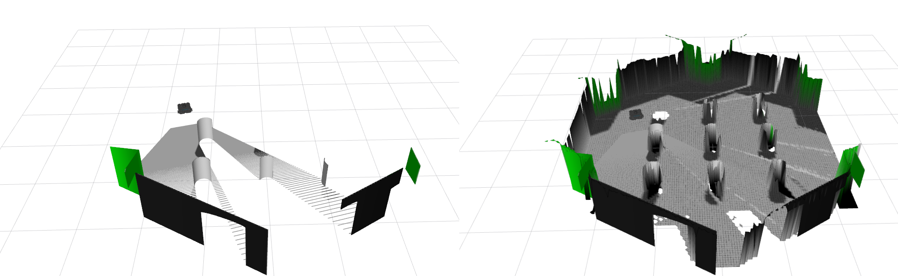

.. _tutorial:

Tutorial
******************************************************************

Build
==================================================================

.. code-block:: bash

  catkin build elevation_mapping_cupy
  catkin build convex_plane_decomposition_ros

Errors
"""""""""""""

If you get error such as

.. code-block:: none

  Make Error at /usr/share/cmake-3.16/Modules/FindPackageHandleStandardArgs.cmake:146 (message):
    Could NOT find PythonInterp: Found unsuitable version "2.7.18", but
    required is at least "3" (found /usr/bin/python)

Build with option.

.. code-block:: bash

  catkin build elevation_mapping_cupy -DPYTHON_EXECUTABLE=$(which python3)

Run
==================================================================

Basic usage.

.. code-block:: bash

  roslaunch elevation_mapping_cupy elevation_mapping_cupy.launch

For the plane segmentation node

.. code-block:: bash

  roslaunch convex_plane_decomposition_ros convex_plane_decomposition.launch

For the sensor node

.. code-block:: bash

  roslaunch elevation_mapping_cupy pointlcoud.launch
  roslaunch elevation_mapping_cupy image.launch

Errors
"""""""""""""

If you build with the install flag under ros melodic, you might get issues with the modules not found:

.. code-block:: bash

  terminate called after throwing an instance of 'pybind11::error_already_set'
    what():  ModuleNotFoundError: No module named 'elevation_mapping_cupy'

This is because python3 modules are installed into a different location.

This can be fixed by including also the python3 modules location in the `PYTHONPATH` by adding following line into the launch file:

.. code-block:: xml

  <env name="PYTHONPATH" value="<path_to_your_install>/lib/python3/dist-packages:$(env PYTHONPATH)" />

Run TurtleBot example
==================================================================

First, install turtlebot simulation.

.. code-block:: bash

  sudo apt install ros-noetic-turtlebot3-gazebo ros-noetic-turtlebot3-teleop

Then, you can run the examples. For the basic version:

.. code-block:: bash

  export TURTLEBOT3_MODEL=waffle
  roslaunch elevation_mapping_cupy turtlesim_example.launch

For fusing semantics into the map such as rgb from a multi modal pointcloud:

.. code-block:: bash

  export TURTLEBOT3_MODEL=waffle
  roslaunch elevation_mapping_cupy turtlesim_semantic_example.launch

For fusing semantics into the map such as rgb from an image:

.. code-block:: bash

  export TURTLEBOT3_MODEL=waffle
  roslaunch elevation_mapping_cupy turtlesim_semantic_image_example.launch

For fusing features extracted with a feature extractor from an image:

.. code-block:: bash

  export TURTLEBOT3_MODEL=waffle
  roslaunch elevation_mapping_cupy turtlesim_features_image_example.launch

Or, for the version including plane segmentation:

.. code-block:: bash

  catkin build convex_plane_decomposition_ros
  export TURTLEBOT3_MODEL=waffle
  roslaunch elevation_mapping_cupy turtlesim_segmentation_example.launch

To control the robot with a keyboard, a new terminal window needs to be opened.
Then run

.. code-block:: bash

  export TURTLEBOT3_MODEL=waffle
  roslaunch turtlebot3_teleop turtlebot3_teleop_key.launch

Velocity inputs can be sent to the robot by pressing the keys `a`, `w`, `d`, `x`. To stop the robot completely, press `s`.

